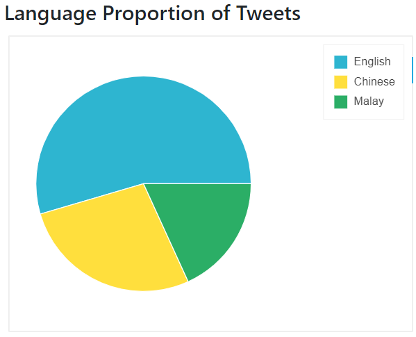
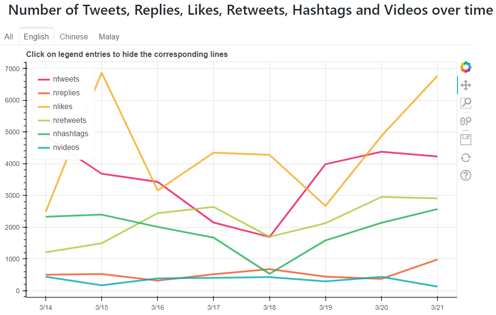
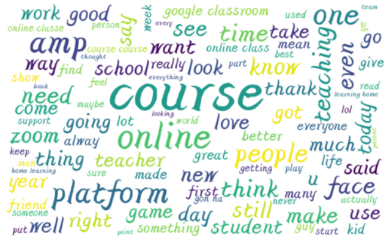
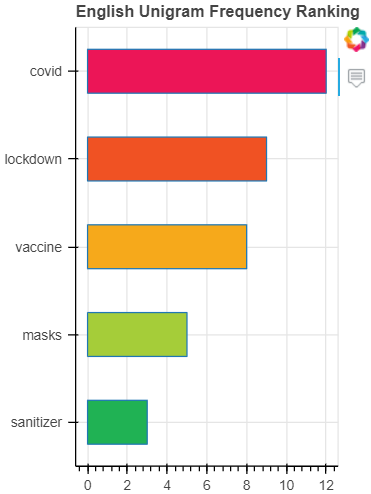
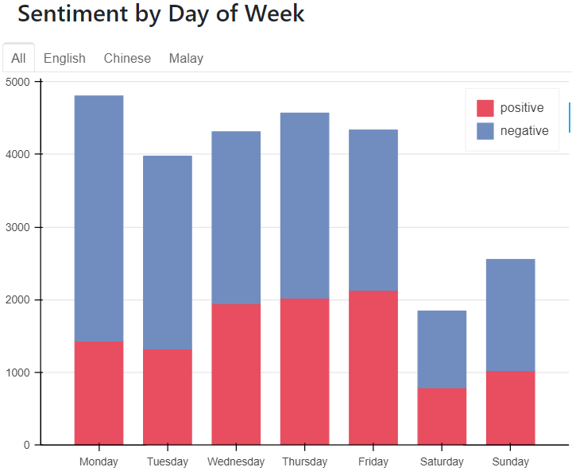
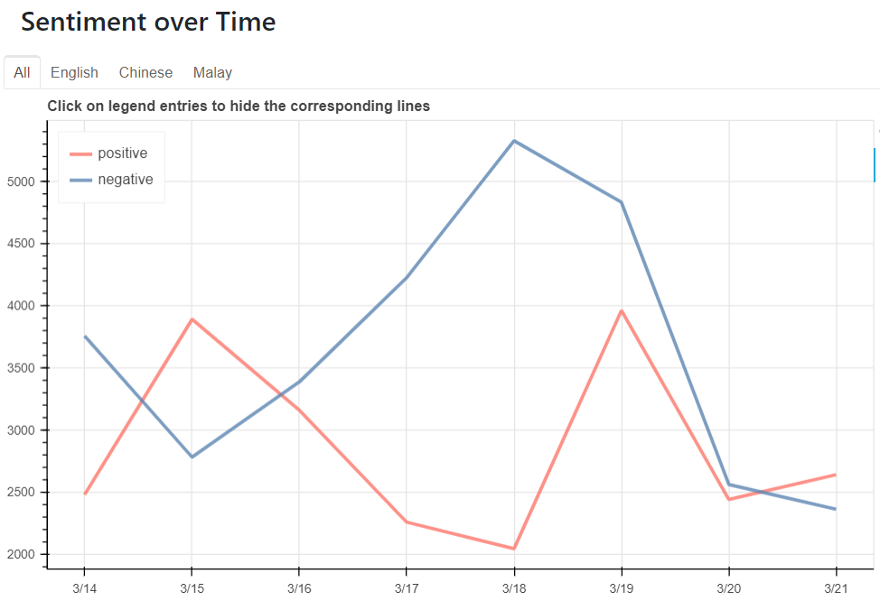
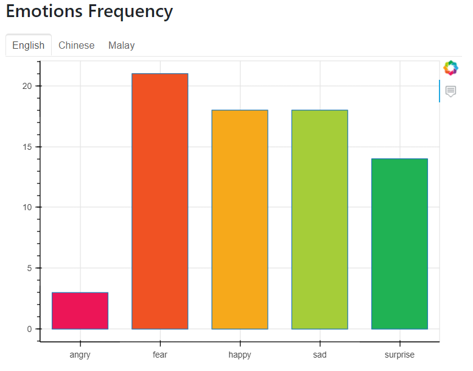

  <h3 align="center">Sentiment and Emotion Analysis Visualization</h3>

  

    This project involves crawling English, Malay and Chinese tweets related to the topic of “Online Learning” from Twitter, cleaning the crawled data, performing sentiment and emotion
analysis and visualizing the result.
  

  
<h3 style="display: inline-block">Table of Contents</h3>

  <ol>
    <li>
      <a href="#about-the-project">About The Project</a>
    </li>
    <li>
      <a href="#demo">Demo</a>
    </li>
    <li>
      <a href="#prerequisite">Prerequisite</a>
    </li>
    <li>
      <a href="#setup">Installation</a>
    </li>
  </ol>

<h3 id="about-the-project">About The Project</h3>

Due to the COVID-19 pandemic, many countries including Malaysia are under lockdown to contain the spread of the virus. 
As a result, teaching and learning activities are shifted online. As students, we are interested to find out what people think and feel about online learning.
Therefore, this project is carried out to analyse the sentiments and emotions towards online learning on Twitter.
This project was done in a group of 4 and I was responsible for visualizing the result of the sentiment and emotion analysis.

<b>This project was built with:</b>
 
* [HappyBase](https://happybase.readthedocs.io/en/latest/)
* [Flask](https://flask.palletsprojects.com/en/2.0.x/)
* [Bootstrap](https://getbootstrap.com/)
* [Bokeh](https://docs.bokeh.org/en/latest/index.html)
* [Matplotlib](https://matplotlib.org/)
* [Wordcloud](https://amueller.github.io/word_cloud/)

<h3 id="demo">Demo</h3>

  
Language Proportion Pie Chart

  

 

  
Frequency over Time Line Graph

  

  

  
English Word Cloud

  

 

  
English Unigram Ranking Bar Chart

  

 

  
Sentiment by Day Stacked Bar Chart

  

 

  
Sentiment over Time Line Graph

  

 

  
Emotion Frequency Bar Chart

  

  
Emotion over Time Line Bar Chart

  

<h3 id="prerequisite">Prerequisite</h3>
<ul>
    <li>
      Requirements.txt
    </li>
</ul>

<h3 id="setup">Installation</h3>
<ul>
    <li>
      flask app.py
    </li>
</ul>
<i>The complete source code is not available yet.</i>
